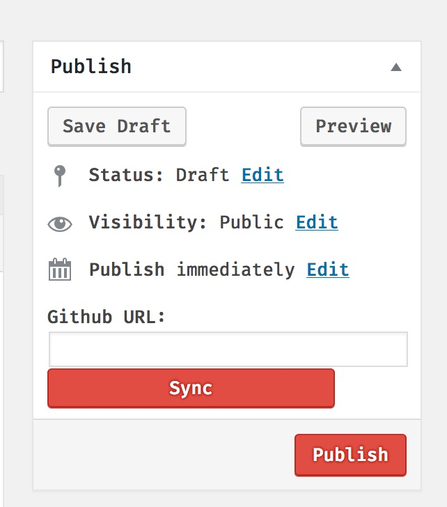

Wordpress Github Fetcher
---

### Motivation:
For me, my habit for writing blogs is write a markdown file and put all the images into a folder same level then push them into Github. Then, I need to figure out how to make my Blog system to show the content.

For emlog, I used to write a blog to show the rendered result from github. Because I found that the render is good, and also I can use the Github CDN to save the bandwidth.

So, for wordpress, I need to write such a plugin myself mostly.

### How to Use:
Once active the plugin, you open your wordpress editor page and you will see such a input like below:
> 

You can paste your github url to where you article is. For me, most are `https://github.com/xxx/xx.md`, then press **Sync**. You will see the result will show in the editor.

So far, we only support the older editor.

### How to install:
You can install by uploading plugins so far. Download this plugin from release tab, and install by uploading.

TODO: Will upload to the wordpress official plugin website.

